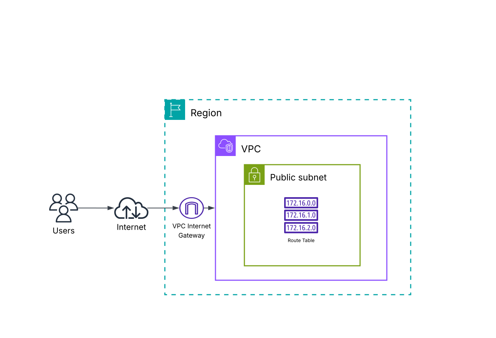
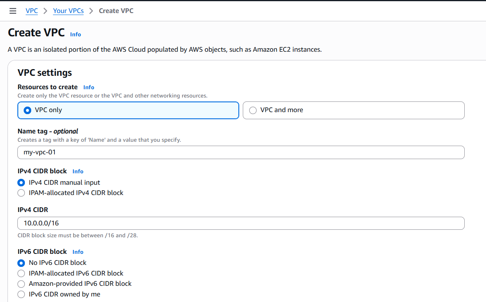
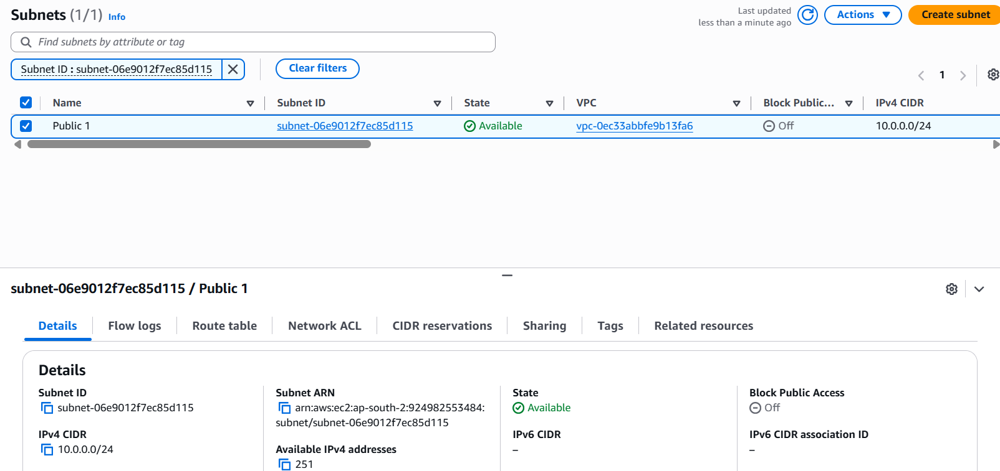
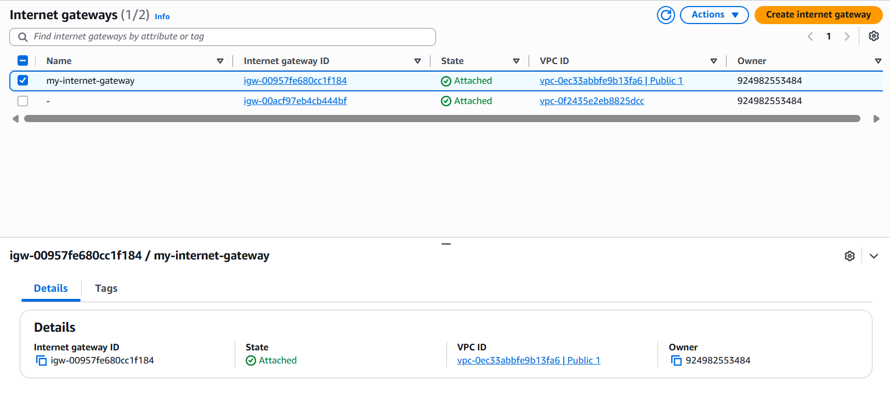
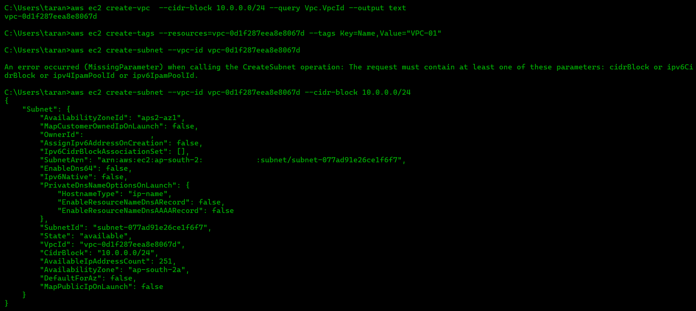

# Project 1 — Build a Virtual Private Cloud

## Overview

This project focused on building a custom **Amazon VPC** and understanding the fundamental components of AWS networking.

The environment was configured with a VPC, subnet, route table, and Internet Gateway to understand how network resources communicate within AWS.

## Objectives

* Create a custom Amazon VPC
* Understand CIDR-based IP addressing
* Create and configure a subnet
* Configure an Internet Gateway
* Configure routing using a route table
* Understand how public network connectivity works in AWS
* Practice managing AWS resources using the AWS Management Console and AWS CLI

## AWS Services & Technologies

* Amazon VPC
* Subnets
* Route Tables
* Internet Gateway
* AWS CloudShell
* AWS CLI

## Architecture

## Network Configuration

| Component        | Configuration                  |
| ---------------- | ------------------------------ |
| VPC CIDR         | `10.0.0.0/16`                  |
| Subnet           | `10.0.0.0/24`                  |
| Subnet Type      | Public                         |
| Internet Gateway | Attached                       |
| Route Table      | Configured                     |
| Internet Route   | `0.0.0.0/0 → Internet Gateway` |

## Implementation

### 1. VPC Creation

I created a custom VPC using the CIDR block `10.0.0.0/16`.

The CIDR block provides the private IPv4 address space from which smaller subnet ranges can be allocated.

### 2. Subnet Configuration

I created a subnet within the VPC using a CIDR range from the VPC address space.

The subnet was configured as a public subnet so that resources deployed into it could be configured for internet connectivity.

### 3. Internet Gateway

I created an Internet Gateway and attached it to the VPC.

The Internet Gateway provides a path between the VPC and the internet when the subnet's route table is configured accordingly.

### 4. Route Table

I configured a route table associated with the public subnet.

An internet-bound route was configured as:

`0.0.0.0/0 → Internet Gateway`

This allows traffic destined for the internet to be routed through the Internet Gateway.

## AWS CLI / CloudShell

I also used **AWS CloudShell** and **AWS CLI** to interact with AWS resources.

Example commands used during the project included commands for creating and managing VPC resources.

[View AWS CLI Commands](commands.md)

## Key Concepts Learned

### VPC

A VPC provides an isolated virtual network environment in AWS where cloud resources can be deployed and network connectivity can be controlled.

### CIDR

CIDR notation is used to define IP address ranges for the VPC and its subnets.

### Subnets

Subnets divide the VPC address space into smaller network segments.

### Internet Gateway

An Internet Gateway provides internet connectivity for resources when the appropriate routing and public IP configuration are present.

### Route Tables

Route tables determine where network traffic from a subnet is directed.

## Challenges & Troubleshooting

During the project, I worked through the configuration of multiple VPC components and verified how they interact with one another.

One of the key areas I focused on was understanding the relationship between the **subnet, route table, and Internet Gateway** rather than treating them as independent resources.

## What I Learned

This project gave me practical experience with the basic building blocks of AWS networking.

I learned how a VPC provides the network boundary, how subnets divide the address space, how route tables control traffic, and how an Internet Gateway can provide a path to the internet.

I also gained experience using **AWS CloudShell and AWS CLI** alongside the AWS Management Console.

## Screenshots

All implementation screenshots are available in the [`screenshots`](screenshots/) directory.

## Project Status

**Completed**
