# Project 2 — VPC Traffic Flow and Security

## Overview

This project focused on understanding how network traffic flows through an **Amazon VPC** and how different AWS networking components control and secure that traffic.

I worked with **route tables, Internet Gateways, Security Groups, and Network ACLs** to understand how traffic can be directed and controlled at both the resource and subnet levels.

I also used **AWS CLI** to create and manage resources and explored **EC2 Global View** to track resources across AWS Regions.

## Objectives

* Understand how traffic flows through a VPC
* Configure and analyze route tables
* Understand route destinations and targets
* Configure Security Groups
* Understand inbound and outbound Security Group rules
* Understand Network ACLs
* Compare Security Groups and Network ACLs
* Understand default and custom Network ACL behavior
* Use AWS CLI to manage VPC resources
* Track resources across AWS Regions using EC2 Global View

## AWS Services & Technologies

* Amazon VPC
* Subnets
* Route Tables
* Internet Gateway
* Security Groups
* Network ACLs
* Amazon EC2
* EC2 Global View
* AWS CloudShell
* AWS CLI

## Architecture

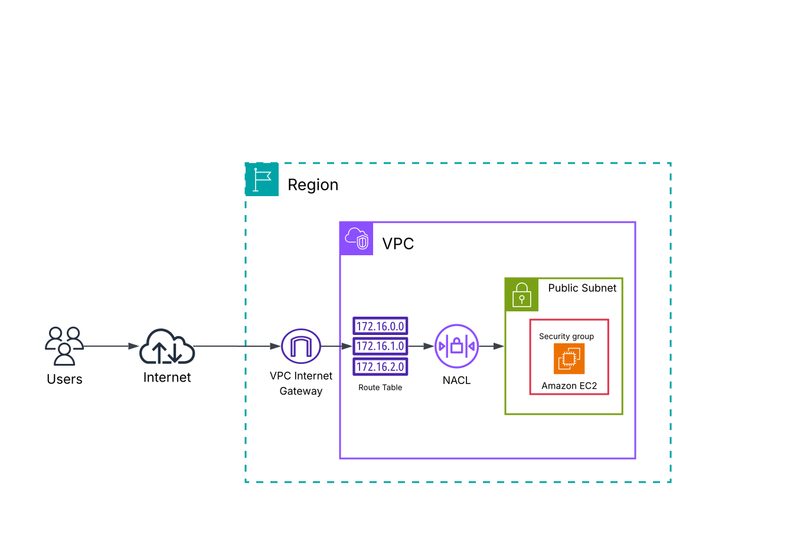

## Network Configuration

| Component        | Configuration              |
| ---------------- | -------------------------- |
| VPC              | `vpc-xxxxxxxxx`    |
| VPC CIDR         | `10.0.0.0/16`              |
| Subnet CIDR      | `10.0.0.0/24`              |
| Subnet           | `subnet-xxxxxxxxx` |
| Internet Gateway | `igw-xxxxxxxxx`    |
| Security Group   | `sg-xxxxxxxxxxxxx`     |
| Network ACL      | `acl-xxxxxxxxxx`    |

## Route Tables

A route table contains routes that determine where network traffic from a subnet is directed.

For this project, I examined how a route table can make a subnet public by providing a route to an Internet Gateway.

The internet-bound route was configured as:

```text
Destination: 0.0.0.0/0
Target: Internet Gateway
```

This route provides a path for internet-bound traffic from the subnet.

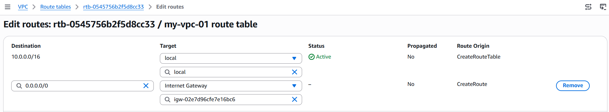

## Route Destination and Target

A route consists of two important components:

* **Destination** — The IP address range that the traffic is intended to reach.
* **Target** — The next network component through which the traffic is forwarded.

For example:

```text
0.0.0.0/0 → Internet Gateway
```

This means that traffic destined for addresses outside the VPC can be forwarded through the Internet Gateway.

## Security Groups

Security Groups act as virtual firewalls for AWS resources.

They control which inbound and outbound network traffic is allowed based on rules involving:

* IP addresses
* Ports
* Protocols

In this project, I configured an inbound rule allowing **HTTP traffic on port 80**.

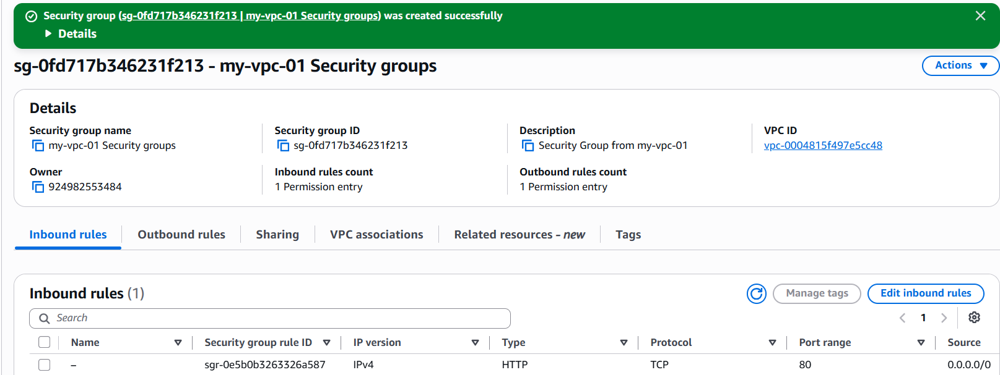

## Inbound vs Outbound Rules

### Inbound Rules

Inbound rules control traffic entering a resource.

For this project, HTTP traffic on port 80 was allowed so that external clients could access the web server running on the EC2 instance.

### Outbound Rules

Outbound rules control traffic leaving a resource.

The Security Group used in the project allowed outbound traffic to destinations including:

```text
0.0.0.0/0
```

unless the outbound rules were modified.

## Network ACLs

Network ACLs control network traffic at the **subnet level**.

Unlike Security Groups, which are associated with individual resources, Network ACLs are associated with subnets.

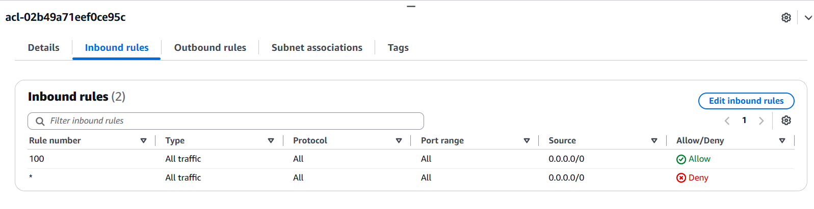

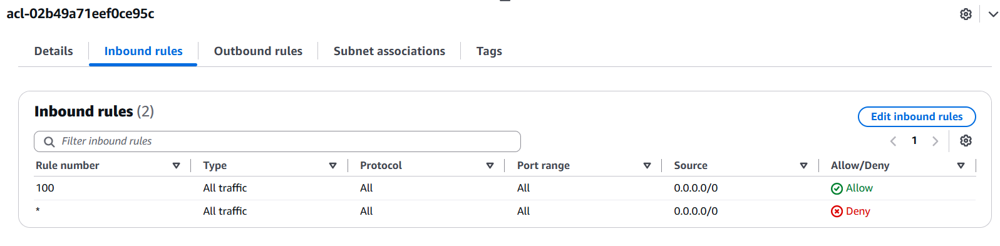

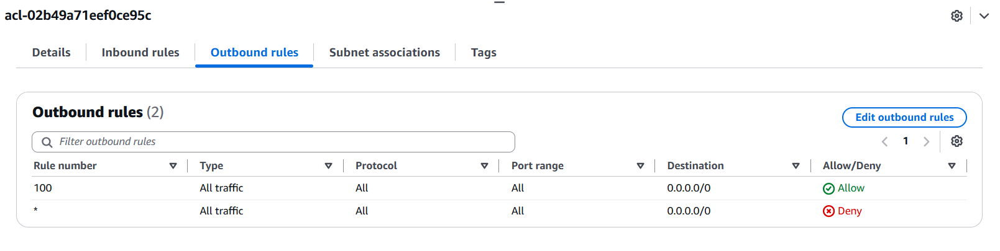

## Security Groups vs Network ACLs

| Feature         | Security Group          | Network ACL                  |
| --------------- | ----------------------- | ---------------------------- |
| Level           | Resource level          | Subnet level                 |
| Associated with | Resources such as EC2   | Subnets                      |
| Traffic control | Inbound and outbound    | Inbound and outbound         |
| State           | Stateful                | Stateless                    |
| Rule evaluation | Allow rules             | Allow and deny rules         |
| Purpose         | Resource-level firewall | Subnet-level traffic control |

Security Groups provide resource-level security, while Network ACLs provide an additional subnet-level layer of network access control.

## Default vs Custom Network ACLs

The **default Network ACL** allows inbound and outbound traffic by default unless its rules are modified.

A **custom Network ACL** denies traffic by default, requiring appropriate rules to be configured to allow required traffic.

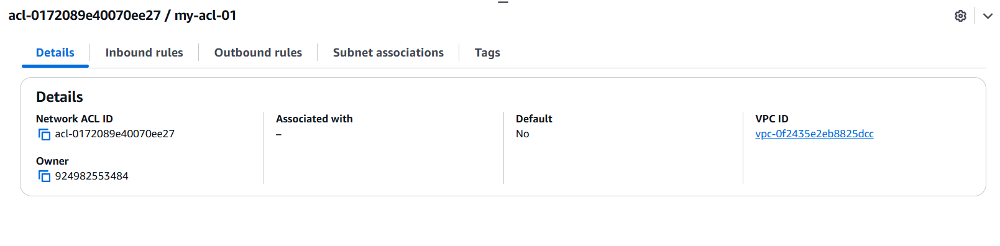

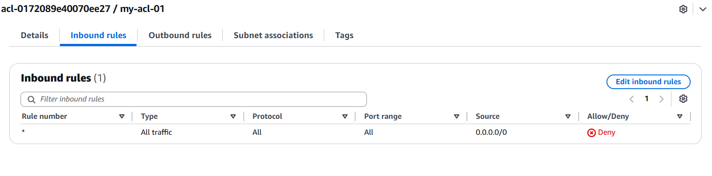

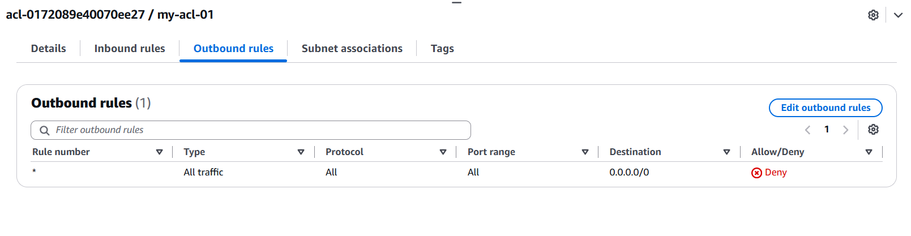

This helped me understand how NACL rules can be used to provide broader subnet-level traffic control.

## Tracking VPC Resources Across Regions

For this project, I created the required resources in a different AWS Region from my usual region.

I used **EC2 Global View** to get a centralized view of EC2 resources across AWS Regions.

This allowed me to identify resources deployed in different regions without manually switching between regions.

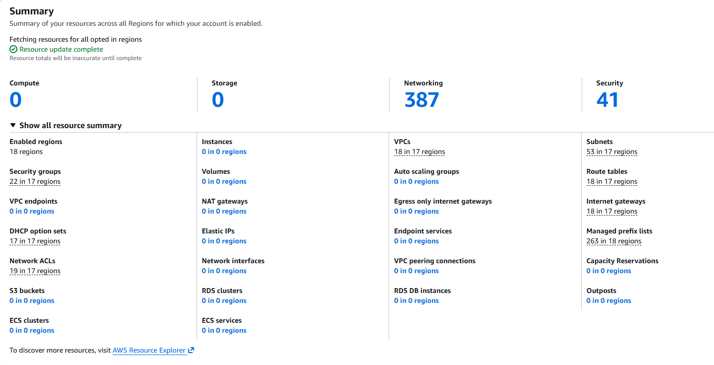

## AWS CLI / CloudShell

I used **AWS CloudShell and AWS CLI** to create and manage AWS resources during the project.

The CLI commands used during the project are documented separately:

[View AWS CLI Commands](commands.md)

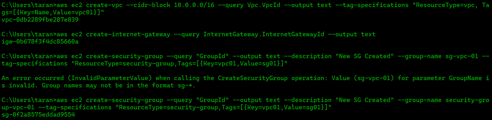

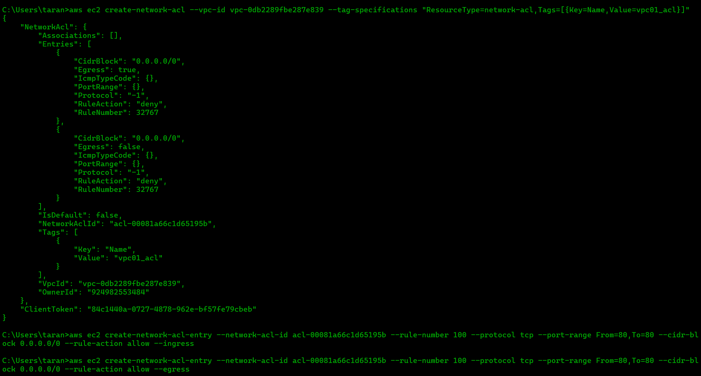

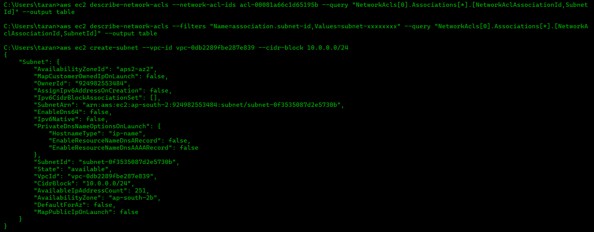

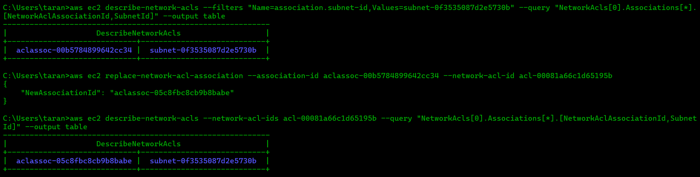

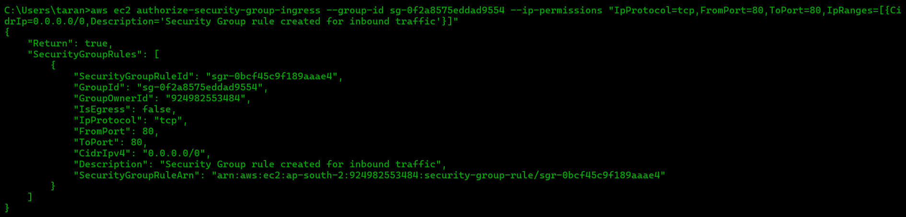

## Key Concepts Learned

### Route Tables

Route tables determine where network traffic from a subnet is directed.

### Route Destination and Target

The destination identifies where traffic is going, while the target identifies the next network component used to forward the traffic.

### Security Groups

Security Groups provide resource-level network access control.

### Network ACLs

Network ACLs provide subnet-level network access control.

### EC2 Global View

EC2 Global View provides a centralized view of EC2 resources across multiple AWS Regions.

## Challenges & Solutions

### Challenge

Understanding how multiple VPC networking components work together to control traffic.

### Solution

I compared the role of each component and traced how traffic is affected by routing and security controls.

Route tables determine the path of traffic, while Security Groups and Network ACLs control whether traffic is permitted at different levels.

## What I Learned

This project improved my understanding of AWS network traffic flow and security.

I learned that **routing and security are separate but interconnected parts of VPC networking**. Route tables determine where traffic should go, while Security Groups and Network ACLs provide different layers of traffic control.

I also gained practical experience using **AWS CLI and CloudShell** and learned how **EC2 Global View** can be used to track resources across AWS Regions.

## Screenshots

All implementation screenshots are available in the [`screenshots`](screenshots/) directory.

## Project Status

**Completed**
