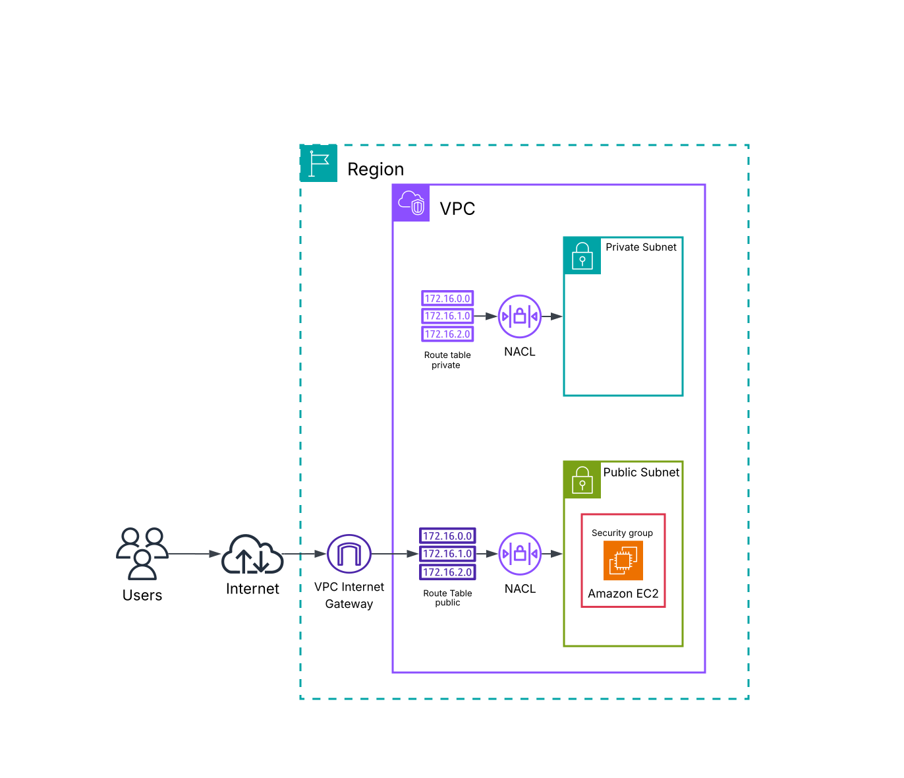
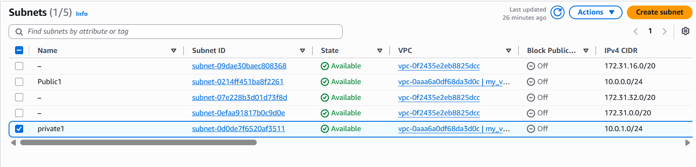
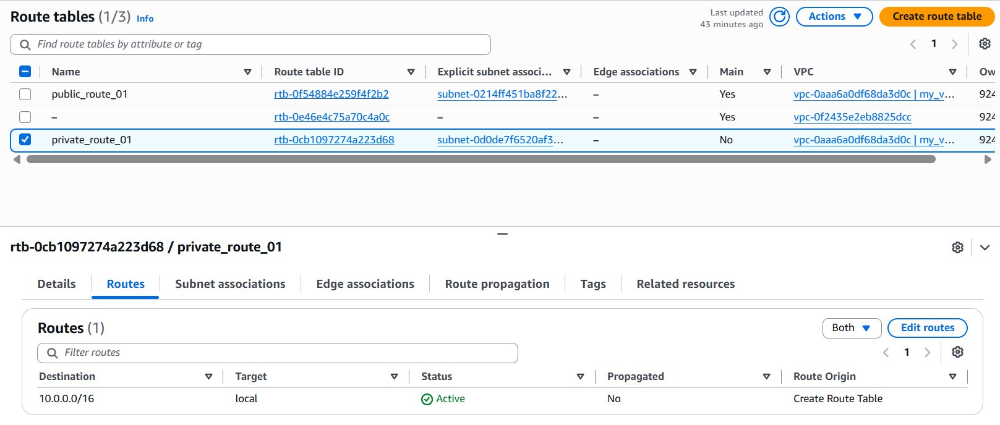
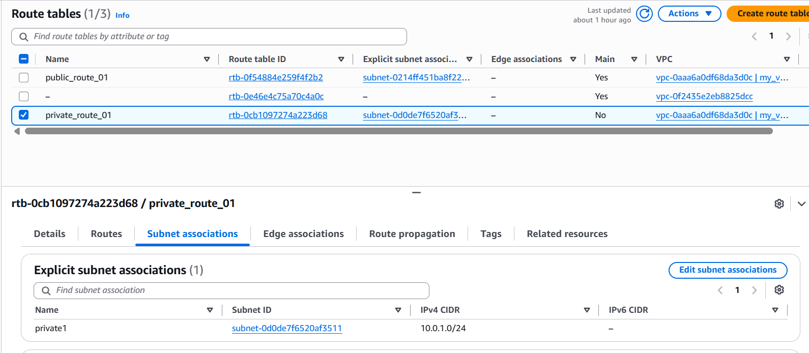
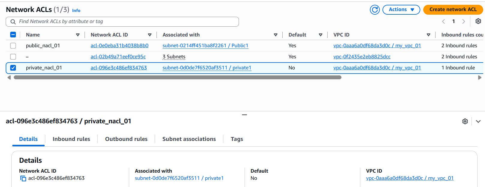
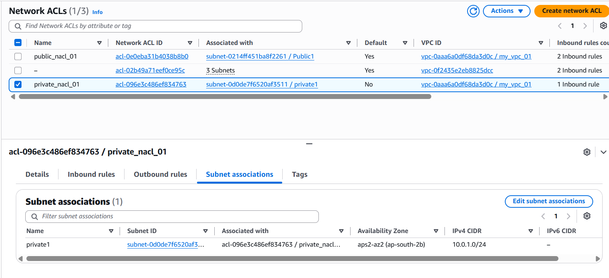
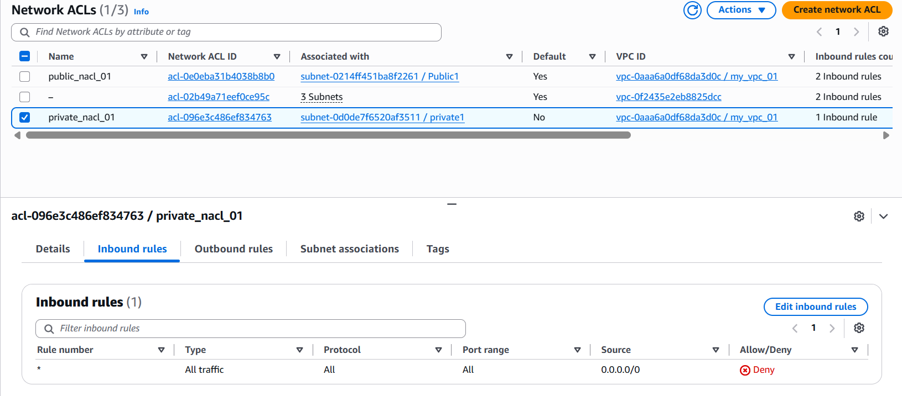
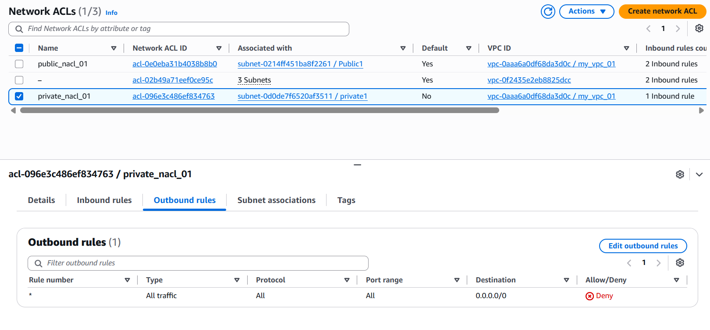

# Project 3 — VPC Private Subnet

## Overview

This project focused on creating and configuring a **private subnet** inside an existing **Amazon VPC** and understanding how private subnets differ from public subnets.

I created a dedicated private subnet, configured a **private route table**, and associated the subnet with a **custom Network ACL**.

I also analyzed how the `local` route enables communication between resources within the VPC, while the absence of a route to an **Internet Gateway** prevents direct internet connectivity from the private subnet.

## Objectives

* Create a private subnet inside an existing VPC
* Configure a dedicated route table for the private subnet
* Understand how private subnet routing works
* Understand the purpose of the `local` route
* Prevent direct internet access from the private subnet
* Create and configure a custom Network ACL
* Associate the Network ACL with the private subnet
* Understand the differences between public and private subnets
* Use AWS CloudShell and AWS CLI to inspect and manage VPC resources

## AWS Services & Technologies

* Amazon VPC
* Subnets
* Route Tables
* Network ACLs
* Internet Gateway
* AWS CLI
* AWS CloudShell

## Architecture



## Network Configuration

| Component           | Configuration      |
| ------------------- | ------------------ |
| VPC                 | `vpc-xxxxxxxxx`    |
| VPC CIDR            | `10.0.0.0/16`      |
| Public Subnet CIDR  | `10.0.0.0/24`      |
| Private Subnet CIDR | `10.0.1.0/24`      |
| Private Subnet      | `subnet-xxxxxxxxx` |
| Private Route Table | `rtb-xxxxxxxxx`    |
| Private Network ACL | `acl-xxxxxxxxxx`   |
| Internet Gateway    | `igw-xxxxxxxxx`    |

## Private Subnet

A **private subnet** is a subnet whose associated route table does not contain a route that provides direct connectivity to an **Internet Gateway**.

For this project, I created a new subnet inside the existing VPC using the CIDR block:

```text
10.0.1.0/24
```

The private subnet was configured separately from the public subnet so that resources deployed within it do not have a direct route to the public internet through an Internet Gateway.



## Private Route Table

I created a dedicated route table for the private subnet.

The route table contains the VPC's local route:

```text
Destination: 10.0.0.0/16
Target: local
```

The `local` route allows resources within the VPC to communicate with other resources whose IP addresses fall within the VPC's CIDR range.

Unlike the public subnet's route table, the private route table does not contain an internet-bound route such as:

```text
Destination: 0.0.0.0/0
Target: Internet Gateway
```

As a result, resources in the private subnet do not have a direct routing path to the internet through the Internet Gateway.



## Route Table Association

After creating the private route table, I associated it with the private subnet.

This ensures that traffic originating from the private subnet follows the routes defined in the dedicated private route table.

The association separates the routing behavior of the private subnet from the public subnet.



## Understanding the Local Route

The private route table contains:

```text
10.0.0.0/16 → local
```

This route represents the internal routing path within the VPC.

It allows resources within the VPC to communicate with other resources using IP addresses within the VPC CIDR range.

For example, traffic between resources in the public and private subnets can remain within the VPC because both subnet CIDR ranges are part of:

```text
10.0.0.0/16
```

The `local` route **does not provide internet connectivity**.

## Public vs Private Subnet

| Feature                      | Public Subnet           | Private Subnet      |
| ---------------------------- | ----------------------- | ------------------- |
| Route to Internet Gateway    | Yes                     | No                  |
| Direct internet connectivity | Possible                | Not directly        |
| Route table                  | Public Route Table      | Private Route Table |
| Typical use                  | Public-facing resources | Internal resources  |
| Internet-bound route         | `0.0.0.0/0 → IGW`       | Not present         |
| VPC internal communication   | Yes                     | Yes                 |

The key difference between a public and private subnet is the **routing configuration of the subnet's associated route table**.

A subnet is considered public when its route table contains a route to an Internet Gateway. A subnet is considered private when its route table does not provide a direct route to an Internet Gateway.

## Private Network ACL

I created a **custom Network ACL** specifically for the private subnet.

Network ACLs operate at the **subnet level** and control inbound and outbound traffic entering and leaving the subnet.

The custom Network ACL was created separately from the Network ACL associated with the public subnet.



## Private Network ACL Association

After creating the custom Network ACL, I associated it with the private subnet.

This ensures that the private subnet uses the rules defined by the dedicated Network ACL.



## Network ACL Rules

The Network ACL provides an additional layer of traffic control at the subnet level.

Inbound and outbound rules can be configured independently to control the traffic allowed to enter or leave the private subnet.





Network ACLs are **stateless**, meaning inbound and outbound traffic are evaluated independently.

The private subnet's lack of a route to an Internet Gateway prevents direct internet connectivity. The Network ACL provides an additional layer of subnet-level traffic filtering.

## AWS CLI

I used **AWS CLI through AWS CloudShell** to inspect and manage VPC networking resources during the project.

The CLI commands used during the project are documented separately:

[View AWS CLI Commands](commands.md)

## Key Concepts Learned

### Private Subnet

A private subnet is a subnet whose route table does not provide a direct route to an Internet Gateway.

It is commonly used for resources that should not be directly reachable from the public internet.

### Private Route Table

A dedicated route table can be associated with a private subnet to control how traffic originating from that subnet is routed.

### Local Route

The `local` route allows communication between resources within the VPC.

For this project:

```text
10.0.0.0/16 → local
```

### Network ACLs

Network ACLs provide **subnet-level traffic filtering** and evaluate inbound and outbound traffic independently.

### Network Segmentation

Separating public and private subnets allows resources with different connectivity requirements to be placed into different network segments.

## Challenges & Solutions

### Challenge

Understanding why the private subnet can communicate with other resources in the VPC even though it does not have a route to an Internet Gateway.

### Solution

I learned that the VPC automatically provides a `local` route for its CIDR block.

The route:

```text
10.0.0.0/16 → local
```

allows traffic between resources using IP addresses within the VPC CIDR range.

A route to an Internet Gateway is required for direct internet-bound connectivity, but it is not required for communication between resources within the VPC.

## What I Learned

This project improved my understanding of **VPC subnet isolation and private network design**.

I learned how to create a private subnet and configure a dedicated route table so that the subnet can communicate internally within the VPC without having a direct route to the internet.

I also gained practical experience creating and associating a **custom Network ACL** with a subnet and understanding how subnet-level traffic filtering works.

Most importantly, I learned that **public and private subnets are primarily differentiated by their routing configuration**, particularly whether the associated route table provides a route to an Internet Gateway.

## Screenshots

All implementation screenshots are available in the [`screenshots`](screenshots/) directory.

## Project Status

**Completed**