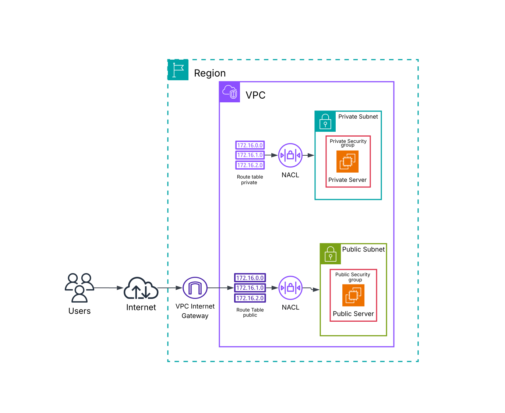
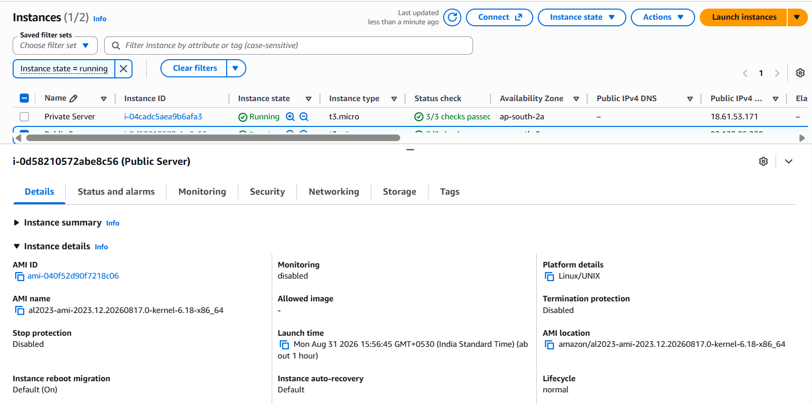
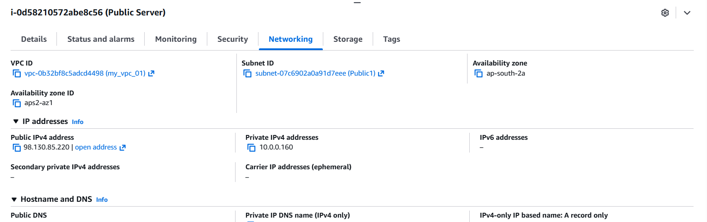
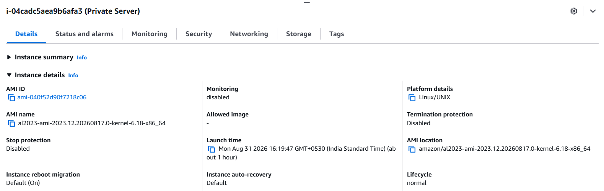
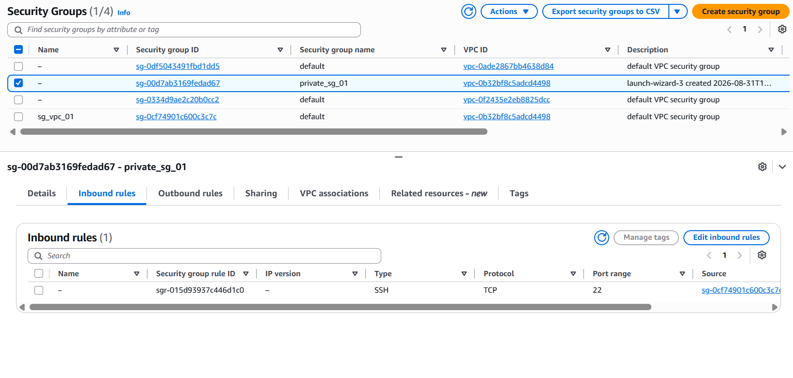
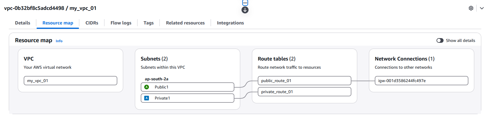

# Project 4 — Launching VPC Resources

## Overview

This project focused on deploying compute resources into the Amazon VPC created and configured throughout the previous networking projects.

I launched two Amazon EC2 instances: one in the **public subnet** and another in the **private subnet**. The public instance was configured for external access, while the private instance was configured with restricted access so that communication was limited to resources within the trusted public Security Group.

The project also introduced the **Amazon VPC creation wizard** and its **VPC resource map**, demonstrating how AWS can provision and visually represent multiple networking components as part of a single VPC configuration.

---

## Objectives

* Launch an EC2 instance in a public subnet
* Launch an EC2 instance in a private subnet
* Understand how subnet placement affects EC2 connectivity
* Configure EC2 instances with appropriate Security Groups
* Configure and use EC2 key pairs
* Understand public and private resource deployment
* Restrict private instance access to trusted resources
* Explore the VPC creation wizard
* Understand the VPC resource map
* Understand how AWS can automatically provision related VPC resources

---

## AWS Services & Technologies

* **Amazon VPC**
* **Amazon EC2**
* **Amazon VPC Resource Map**
* **Security Groups**
* **Subnets**
* **Route Tables**
* **Internet Gateway**
* **Network ACLs**
* **EC2 Key Pairs**
* **AWS Management Console**
* **AWS CLI**

---

# Architecture



The project deployed EC2 resources into both public and private subnets within the VPC.

```text
                         Amazon VPC
                        10.0.0.0/16
                              │
              ┌───────────────┴───────────────┐
              │                               │
        Public Subnet                  Private Subnet
              │                               │
              ▼                               ▼
       Public EC2 Instance            Private EC2 Instance
              │                               │
       Public Security Group          Private Security Group
              │                               │
       Route Table → IGW              Private Route Table
              │                               │
              ▼                               │
          Internet                    Restricted Access
                                              │
                                              ▼
                                    Trusted Public SG
```

The public instance is placed in a subnet with a route to the Internet Gateway, while the private instance does not have direct internet access through its subnet's route table.

---

# Network Configuration

| Component              | Configuration                                     |
| ---------------------- | ------------------------------------------------- |
| VPC                    | Existing VPC created in previous projects         |
| Public Subnet          | Existing public subnet                            |
| Private Subnet         | Existing private subnet                           |
| Public EC2             | Deployed in public subnet                         |
| Private EC2            | Deployed in private subnet                        |
| Public Security Group  | Applied to public EC2                             |
| Private Security Group | Applied to private EC2                            |
| Key Pair               | Configured for EC2 access                         |
| Internet Gateway       | Used by the public subnet's routing configuration |

---

# Implementation

## 1. Launching a Public EC2 Instance

I launched an Amazon EC2 instance inside the existing public subnet.

The instance was configured using an Amazon Linux 2023 AMI and a `t3.micro` instance type as part of the project configuration.

A key pair was configured to provide secure access to the instance.

The public instance was associated with the public subnet and its corresponding Security Group.



### Public Instance Networking

After launching the instance, I inspected its networking information and verified that it was associated with:

* The intended VPC
* The public subnet
* An Availability Zone
* A Security Group
* A Public IPv4 address

The presence of a public IPv4 address allows the instance to be reachable from outside the VPC when the associated routing and security configuration permits the traffic.



---

# 2. Launching a Private EC2 Instance

I then launched a second EC2 instance inside the private subnet.

The private instance was configured separately from the public instance and was not intended to be directly accessible from the public internet.



---

## Private Instance Security Configuration

A separate Security Group was configured for the private instance.

Instead of allowing HTTP access from anywhere on the internet, the inbound rule was restricted to the **public Security Group**.

This means that resources associated with the trusted public Security Group can communicate with the private instance according to the configured rule.

This provides a more restrictive access model than allowing traffic from:

```text
0.0.0.0/0
```



---

# Security Group Design

The Security Group configuration demonstrates an important security principle: **access should be restricted to the smallest trusted scope necessary**.

For the public resource, HTTP access can be permitted from external sources when required.

For the private resource, access was restricted so that the source was the trusted public Security Group rather than the entire internet.

```text
Public EC2
    │
    │ Trusted Security Group
    ▼
Private EC2
```

This reduces unnecessary exposure of private resources.

---

# 3. Exploring the VPC Resource Map

The project also introduced an alternative way of creating an entire VPC environment using the **VPC and more** option in the VPC creation wizard.

Instead of manually creating each networking component separately, the wizard can provision multiple related resources as part of the VPC setup.

These resources can include:

* VPC
* Public subnets
* Private subnets
* Route tables
* Internet Gateway
* Network ACLs

The wizard provides a visual **resource map** showing how the resources are connected.



---

# VPC Resource Map

The resource map provides a visual representation of the relationships between VPC components.

For example:

```text
VPC
│
├── Public Subnet
│      │
│      ├── Public Route Table
│      │
│      └── Internet Gateway
│
└── Private Subnet
       │
       └── Private Route Table
```

This provides a useful way to understand the relationships between subnets, route tables, and gateways without inspecting each resource independently.

---

# VPC Creation: Manual vs Wizard

The project demonstrated two approaches to building VPC infrastructure.

### Manual Configuration

The earlier projects involved creating and configuring individual components such as:

```text
VPC
↓
Subnet
↓
Internet Gateway
↓
Route Table
↓
Network ACL
```

This approach provides a detailed understanding of how each component works.

### VPC Creation Wizard

The VPC creation wizard provides a faster approach by provisioning multiple components together.

It also provides a resource map that makes the resulting architecture easier to visualize.

```text
Manual Configuration
→ Greater control and learning

VPC Wizard
→ Faster provisioning and standardized setup
```

Both approaches are useful depending on the requirements of the environment.

---

# Key Concepts Learned

## EC2 in a VPC

Amazon EC2 instances can be launched into specific VPC subnets, allowing their network connectivity to be controlled through subnet routing and security configuration.

## Public EC2 Instance

A public EC2 instance can be placed in a public subnet with a route to an Internet Gateway and a public IPv4 address.

Its actual accessibility still depends on Security Group and Network ACL rules.

## Private EC2 Instance

A private EC2 instance is deployed in a private subnet without a direct route to an Internet Gateway.

It can communicate with other permitted resources according to the routing and security configuration.

## Security Group Referencing

A Security Group can be used as the source of another Security Group rule.

This allows access to be restricted based on membership in a trusted Security Group rather than relying only on IP addresses.

## Key Pairs

EC2 key pairs provide a mechanism for securely authenticating to instances that support the corresponding access method.

A key pair can be associated with multiple instances when appropriate, although access to the private key must be carefully protected.

## VPC Resource Map

The VPC resource map provides a visual representation of the relationships between networking components inside a VPC.

---

# Challenges & Solutions

### Challenge

Understanding how public and private EC2 instances can coexist inside the same VPC while having different levels of network exposure.

### Solution

I compared the subnet routing and Security Group configurations of both instances.

The public instance was placed in a public subnet with internet connectivity, while the private instance was placed in a private subnet and given a more restrictive Security Group.

---

# What I Learned

This project connected the networking concepts from the previous projects with actual compute resources.

I learned how EC2 instances are deployed into specific VPC subnets and how their accessibility depends on the combination of subnet routing, public IP configuration, and Security Group rules.

The project also demonstrated why private resources should not be exposed directly to the internet when they do not require public access.

Finally, I learned how the VPC creation wizard can simplify infrastructure provisioning and how the resource map can be used to visualize the resulting network architecture.

---

# Key Takeaways

* EC2 instances can be deployed into specific VPC subnets.
* Public and private resources can coexist within the same VPC.
* A public subnet can provide internet connectivity when appropriate routing and public IP configuration are present.
* Private resources should use restricted access rules instead of broad internet-facing rules when possible.
* Security Groups can reference other Security Groups as trusted sources.
* EC2 key pairs provide secure authentication mechanisms for instances.
* The VPC creation wizard can provision multiple networking resources efficiently.
* The VPC resource map provides a visual representation of network relationships.

---

# Screenshots

Implementation screenshots are available in the [`screenshots`](screenshots/) directory.

The screenshots document:

* Public EC2 instance configuration
* Public EC2 networking details
* Private EC2 instance configuration
* Private EC2 Security Group
* VPC resource map

---

# Project Status

**Completed**