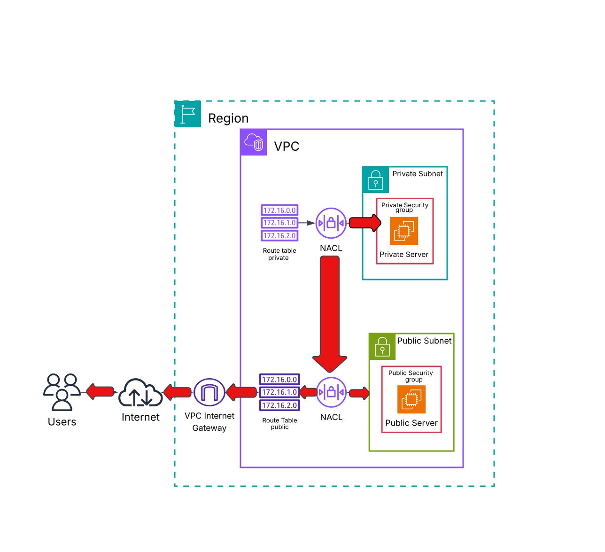
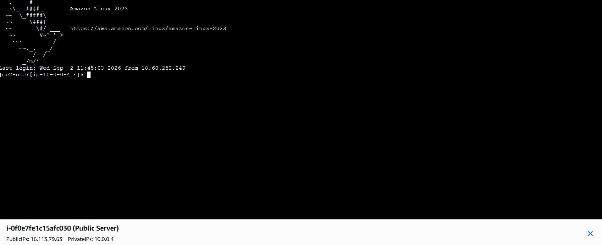
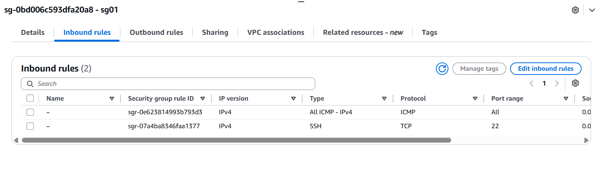
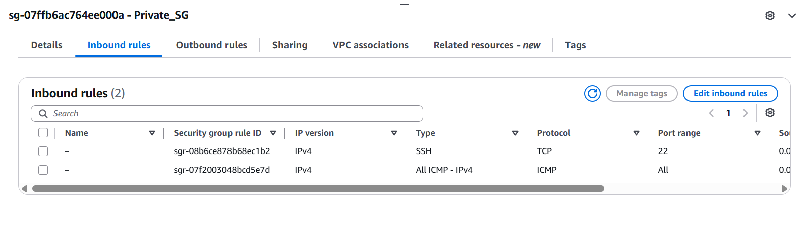
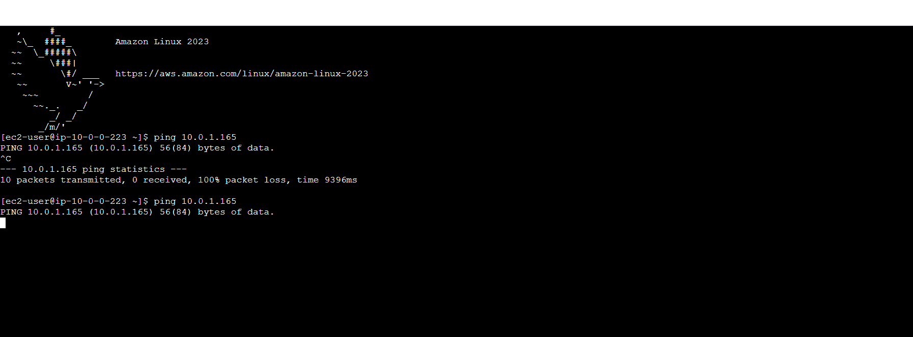
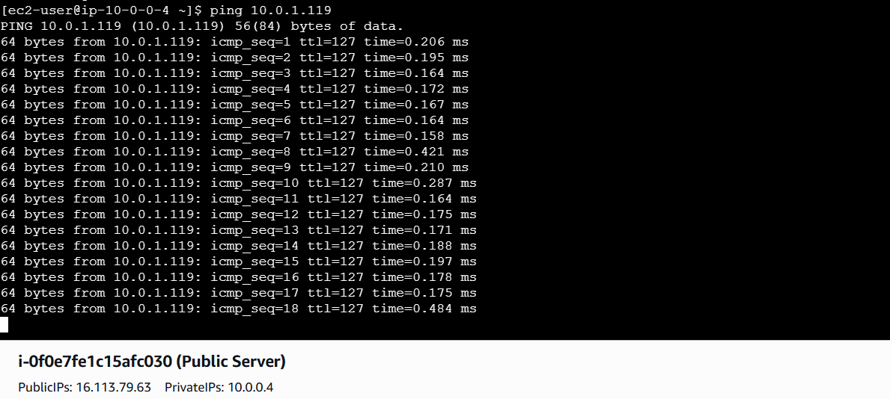
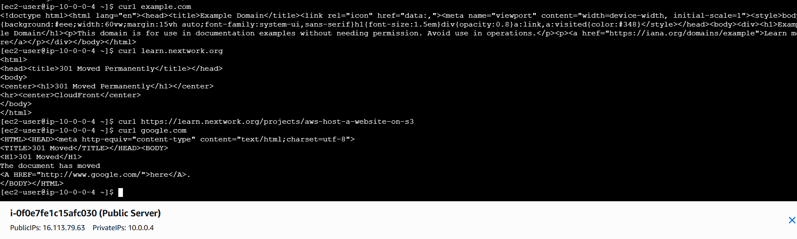

# Project 5 — Testing VPC Connectivity

## Overview

This project focused on testing and troubleshooting network connectivity between resources deployed within an Amazon VPC.

The project involved connecting to a public EC2 instance using EC2 Instance Connect, testing communication between a public and private EC2 instance using `ping`, troubleshooting connectivity failures, and testing internet connectivity from the public EC2 instance using `curl`.

A major part of the project was troubleshooting a connectivity issue between the public and private servers. The issue was resolved by reviewing and correcting the relevant **Network ACL, Security Group, and routing configuration**.

This project provided practical experience in diagnosing VPC connectivity problems by examining the different networking and security components that control traffic flow.

---

# Objectives

* Connect to an EC2 instance using EC2 Instance Connect
* Verify connectivity to a public EC2 instance
* Test communication between public and private EC2 instances
* Use `ping` to test network reachability
* Troubleshoot failed connectivity between VPC resources
* Analyze Security Group configuration
* Analyze Network ACL configuration
* Verify routing configuration
* Test internet connectivity from a public EC2 instance
* Use `curl` to make an HTTP request to an external website
* Understand how multiple VPC components work together to enable or restrict connectivity

---

# AWS Services & Technologies

* **Amazon VPC**
* **Amazon EC2**
* **EC2 Instance Connect**
* **Security Groups**
* **Network ACLs**
* **Route Tables**
* **Internet Gateway**
* **AWS Management Console**
* **Linux Networking Commands**

  * `ping`
  * `curl`

---

# Architecture



The project tested connectivity across different parts of the VPC architecture.

Connectivity between the instances depends on the combined behavior of:

* Route tables
* Security Groups
* Network ACLs
* Subnet configuration

---

# 1. Connecting to the Public EC2 Instance

The first connectivity test was to verify whether I could connect to the public EC2 instance.

I used **EC2 Instance Connect**, which provides browser-based access to an EC2 instance directly through the AWS Management Console.

EC2 Instance Connect simplifies the connection process by handling the temporary authentication mechanism without requiring me to manually configure an SSH client and local key-pair connection.



---

# 2. Troubleshooting SSH Connectivity

My initial attempt to connect to the public EC2 instance failed because the required inbound SSH traffic was not permitted by the Security Group.

The Security Group was missing an appropriate inbound rule for SSH.

I resolved the issue by adding an inbound rule allowing SSH traffic on port `22`.

```text
Protocol: TCP
Port: 22
Purpose: SSH
```

After updating the Security Group, I was able to establish the connection to the public EC2 instance.




### Key Learning

A public IP address alone does not guarantee that an EC2 instance can be accessed.

Connectivity also depends on the applicable security and routing configuration.

---

# 3. Testing Connectivity Between EC2 Instances

After connecting to the public EC2 instance, I tested connectivity between the public and private EC2 instances.

I used the Linux `ping` command to test whether the private instance was reachable from the public instance.

The command used was:

```bash
ping <PRIVATE_EC2_IP>
```

The private EC2 instance's private IP address was used as the destination.

---

# 4. Initial Ping Failure

The first connectivity test did not return successful responses.

This indicated that traffic between the public and private instances was not being permitted or was not reaching the destination correctly.



This became the primary troubleshooting challenge of the project.

---

# 5. Troubleshooting VPC Connectivity

To identify the cause of the failed connectivity, I reviewed the networking and security configuration between the two EC2 instances.

The troubleshooting process involved examining:

* Route tables
* Security Groups
* Network ACLs
* Subnet configuration

The objective was to determine where the traffic was being blocked.

---

## Security Group Configuration

I reviewed the Security Groups associated with the EC2 instances to verify that the required traffic was allowed.

Security Groups act as virtual firewalls at the resource level and can restrict inbound and outbound traffic based on:

* Protocol
* Port
* Source or destination

The appropriate rules were configured to allow the required communication between the instances.

---

## Network ACL Configuration

I also reviewed the Network ACL associated with the subnet.

Network ACLs operate at the subnet level and can allow or deny inbound and outbound traffic.

The NACL configuration was corrected to permit the required traffic between the public and private subnets.

This demonstrated that a connection can fail even when a Security Group appears to allow the traffic if another network security layer is blocking it.

---

## Route Table Configuration

The relevant route table configuration was also reviewed to ensure that the traffic had an appropriate route between the resources.

The troubleshooting process reinforced that successful connectivity requires both:

```text
Correct Routing
        +
Required Security Permissions
        =
Successful Connectivity
```

---

# 6. Successful Connectivity Test

After correcting the required Network ACL and Security Group configuration and verifying the routing configuration, I repeated the connectivity test.

The ping test was successful, confirming that communication between the public and private EC2 instances was now functioning.



This demonstrated the importance of checking **multiple networking layers** when troubleshooting VPC connectivity.

---

# 7. Testing Internet Connectivity

After verifying connectivity between the EC2 instances, I tested internet connectivity from the public EC2 instance.

For this test, I used the `curl` command.

```bash
curl example.com
```

The command successfully returned the HTML content from the website.



This confirmed that the public EC2 instance had a working path to the internet.

---

# Ping vs Curl

Although both commands can be useful during connectivity troubleshooting, they serve different purposes.

| Command | Primary Purpose                     | Protocol / Method                        |
| ------- | ----------------------------------- | ---------------------------------------- |
| `ping`  | Tests reachability of a host        | ICMP                                     |
| `curl`  | Makes requests to URLs and services | HTTP/HTTPS and other supported protocols |

### Ping

`ping` sends ICMP Echo Requests to a destination and checks whether responses are received.

Example:

```bash
ping <PRIVATE_EC2_IP>
```

This was used to test reachability between the public and private EC2 instances.

### Curl

`curl` makes a request to a specified URL and can retrieve the response.

Example:

```bash
curl example.com
```

This was used to verify internet connectivity from the public EC2 instance.

---

# Connectivity Troubleshooting Workflow

The project provided practical experience with a structured approach to troubleshooting network connectivity.

The general workflow followed was:

```text
Connectivity Failure
        │
        ▼
Check Destination
        │
        ▼
Check Route Table
        │
        ▼
Check Security Group
        │
        ▼
Check Network ACL
        │
        ▼
Retest Connectivity
        │
        ▼
Successful Connection
```

This approach helps identify whether traffic is being blocked by routing or by one of the security layers.

---

# Network Layers Involved

The connectivity tests demonstrated how several AWS components work together.

### Route Table

Determines where network traffic is directed.

### Security Group

Controls traffic at the EC2 resource level.

### Network ACL

Controls traffic at the subnet level.

### Internet Gateway

Provides a path between a VPC and the internet when the appropriate routing and other configuration requirements are satisfied.

The project demonstrated that successful connectivity requires the relevant components to work together correctly.

---

# Challenges & Troubleshooting

## Challenge 1 — Unable to Connect to Public EC2

### Problem

The initial attempt to connect to the public EC2 instance failed.

### Cause

The Security Group did not contain the required inbound SSH rule.

### Resolution

I added an inbound rule allowing SSH traffic on port `22`.

---

## Challenge 2 — Public EC2 Could Not Reach Private EC2

### Problem

The initial `ping` test from the public EC2 instance to the private EC2 instance failed.

### Investigation

I reviewed:

* Security Group rules
* Network ACL rules
* Route table configuration

### Resolution

I corrected the required Network ACL and Security Group configuration and verified the routing configuration.

The connectivity test then succeeded.

---

# Key Concepts Learned

## Connectivity Is Multi-Layered

A successful network connection depends on multiple components working together.

A resource may have a valid IP address and route but still be unreachable because a Security Group or Network ACL is blocking the traffic.

---

## Security Groups vs Network ACLs

This project reinforced the difference between the two:

```text
Security Group
→ Resource-level traffic control

Network ACL
→ Subnet-level traffic control
```

Both can affect whether communication between EC2 instances succeeds.

---

## Public Connectivity

A public EC2 instance requires more than simply having a public IP address.

The networking configuration must provide an appropriate path to the internet, and the relevant security controls must allow the required traffic.

---

## Troubleshooting Requires Layer-by-Layer Analysis

When connectivity fails, checking only one component is not enough.

A useful troubleshooting process is:

```text
1. Destination
2. Route
3. Security Group
4. Network ACL
5. Retest
```

This project provided practical experience applying that approach.

---

# What I Learned

This project significantly improved my understanding of how to troubleshoot connectivity problems inside an AWS VPC.

I learned how to use EC2 Instance Connect to access an EC2 instance, how to test communication using `ping`, and how to verify internet access using `curl`.

The most valuable part of the project was troubleshooting the failed public-to-private connectivity test. By examining the Security Group, Network ACL, and route configuration, I was able to identify and correct the configuration preventing the traffic from succeeding.

This demonstrated that AWS networking problems often require analyzing multiple layers rather than focusing on a single resource.

---

# Key Takeaways

* EC2 Instance Connect provides browser-based access to EC2 instances.
* SSH access requires an appropriate inbound Security Group rule.
* `ping` can be used to test host reachability using ICMP.
* `curl` can be used to test access to web resources and services.
* Route tables determine traffic paths.
* Security Groups provide resource-level traffic control.
* Network ACLs provide subnet-level traffic control.
* Connectivity failures can result from multiple configuration layers.
* Systematic, layer-by-layer troubleshooting is essential for diagnosing VPC networking issues.

---

# Screenshots

Implementation evidence for this project is available in the [`screenshots`](screenshots/) directory.

The screenshots document:

* Public EC2 connection
* SSH Security Group configuration
* Initial connectivity failure
* Successful public-to-private connectivity
* Internet connectivity using `curl`

---

# Project Status

**Completed**