# Project 6 — VPC Peering

## Overview

This project focused on establishing private network connectivity between two Amazon VPCs using **VPC Peering**.

The project involved creating two separate VPC networks, configuring their networking components, establishing a VPC peering connection between them, updating the relevant route tables, and testing communication between resources across the two VPCs.

A major part of the project was understanding that creating a VPC peering connection alone does not automatically enable communication between VPCs. The appropriate **route table entries and security configurations** must also be configured to allow traffic between the peered networks.

This project provided practical experience with connecting isolated VPC networks and understanding how AWS routes traffic between resources located in different VPCs.

---

# Objectives

* Create and configure two separate VPCs
* Configure CIDR blocks for the VPCs
* Create subnets within the VPCs
* Launch EC2 resources in the VPCs
* Create a VPC peering connection
* Understand the purpose of VPC peering
* Accept and activate the peering connection
* Configure route tables for cross-VPC communication
* Update Security Group rules to allow required traffic
* Test connectivity between resources in different VPCs
* Troubleshoot cross-VPC connectivity issues
* Understand how VPC peering enables private communication between VPCs

---

# AWS Services & Technologies

* **Amazon VPC**
* **Amazon EC2**
* **VPC Peering**
* **Route Tables**
* **Security Groups**
* **Subnets**
* **AWS Management Console**
* **Linux Networking Commands**
  * `ping`

---

# Architecture

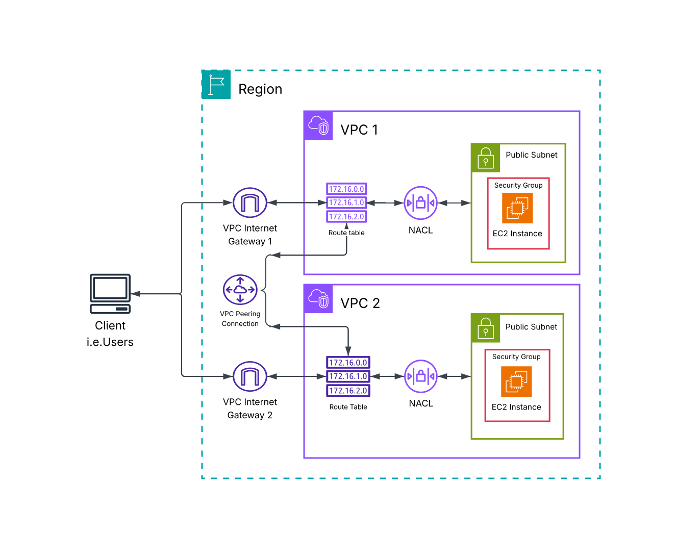

---

# 1. Creating the VPCs

The first step was to create two separate VPCs.
Each VPC was assigned its own CIDR block to ensure that the networks did not overlap.

For example:

```text
VPC 1
CIDR: 10.1.0.0/16

VPC 2
CIDR: 10.2.0.0/16
```

Using non-overlapping CIDR ranges is important because VPC peering requires the IP address ranges of the two VPCs to be non-overlapping.

### Key Learning

Two VPCs cannot be effectively peered when their CIDR blocks overlap.
Planning IP address ranges is therefore an important part of designing interconnected AWS networks.

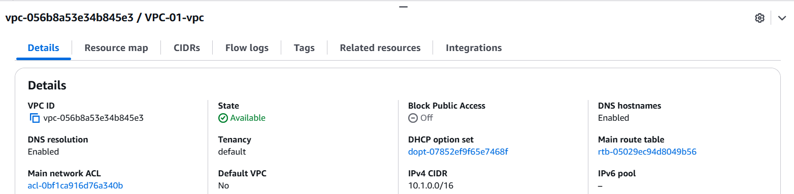
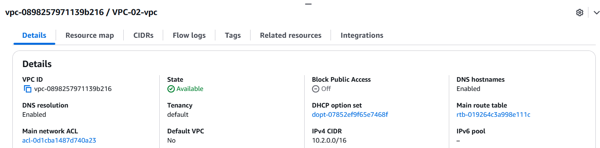

---

# 2. Configuring Subnets

After creating the VPCs, I configured subnets within the networks.
The subnets provided network segments where EC2 resources could be deployed.

Example:

```text
VPC 1
10.1.0.0/16
└── Subnet
    10.1.1.0/24

VPC 2
10.2.0.0/16
└── Subnet
    10.2.1.0/24
```

The subnets were associated with their respective route tables.

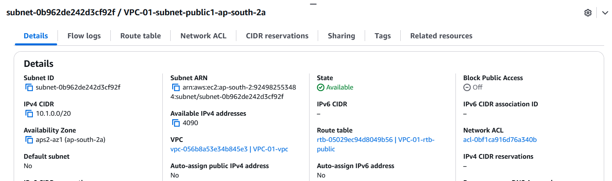
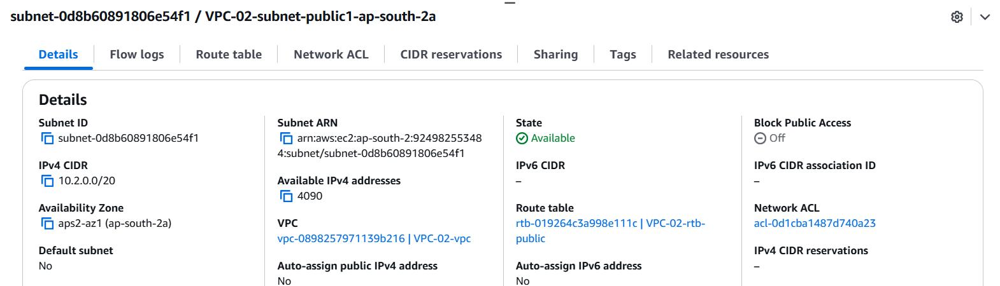

---

# 3. Launching EC2 Instances

I launched EC2 instances within the configured subnets.
These instances were used to test communication between the two VPCs.
The instances had private IP addresses belonging to their respective VPC CIDR ranges.

For example:

```text
EC2 Instance 1
VPC: VPC 1
Private IP: 10.1.1.x

EC2 Instance 2
VPC: VPC 2
Private IP: 10.2.1.x
```

The EC2 instances provided endpoints that could be used to verify whether cross-VPC communication was working correctly.

---

# 4. Creating the VPC Peering Connection

The next step was to create a **VPC Peering Connection** between the two VPCs.
VPC peering establishes a networking relationship between two VPCs that allows them to communicate using private IP addresses.
The peering connection was configured between:

```text
Requester VPC
VPC 1

Accepter VPC
VPC 2
```

### Key Learning

A VPC peering connection creates the networking relationship between two VPCs, but it does **not automatically configure routing**.
Route tables must still be updated to direct traffic through the peering connection.

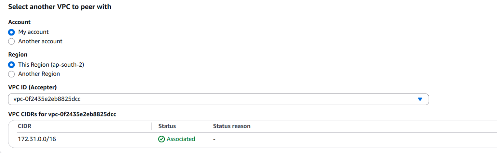

---

# 5. Accepting the Peering Connection

After creating the peering connection, the request needed to be accepted by the peer VPC.
Once accepted, the peering connection transitioned into an active state.
The connection could then be used as a target in route table entries.
The active peering connection provided the underlying private path between the two VPCs.

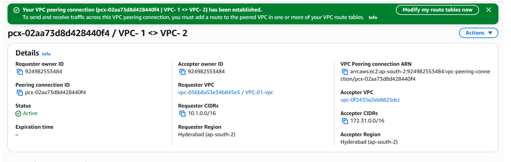
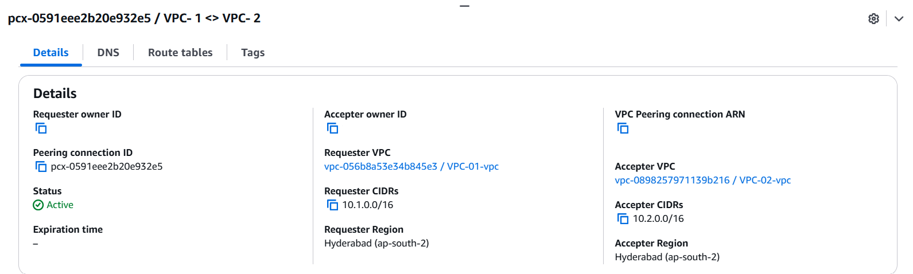

---

# 6. Configuring Route Tables

Creating the peering connection was not sufficient by itself.
I updated the route tables associated with the subnets to tell AWS where traffic destined for the other VPC should be sent.
For VPC 1, traffic destined for VPC 2 was routed through the VPC peering connection.

Example:

```text
Destination: 10.2.0.0/16
Target: VPC Peering Connection
```

For VPC 2, the reverse route was configured:

```text
Destination: 10.1.0.0/16
Target: VPC Peering Connection
```

### Key Learning

VPC peering is a **two-sided routing configuration**.
Both VPCs need appropriate routes for traffic to travel in both directions.

```text
VPC 1
10.1.0.0/16
       │
       │
       ▼
VPC Peering
       │
       │
       ▼
VPC 2
10.2.0.0/16
```

Without the appropriate route table entries, traffic will not know that the peering connection should be used to reach the other VPC.

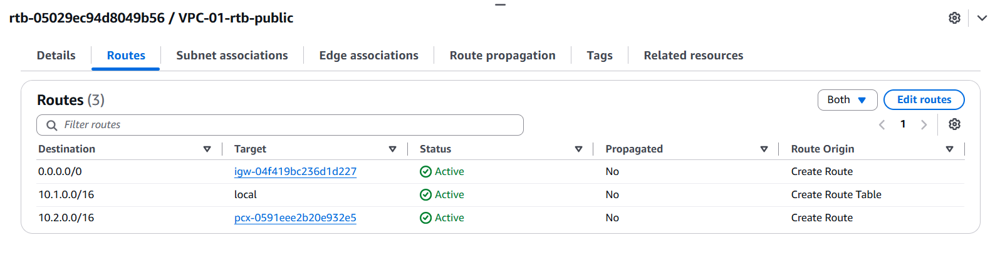
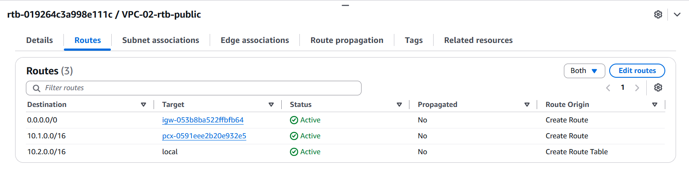

---

# 7. Configuring Security Groups

I also reviewed the Security Groups associated with the EC2 instances.
Security Groups control inbound and outbound traffic at the resource level.
The required traffic between the two VPCs was permitted by configuring the appropriate Security Group rules.

For example:

```text
Protocol: ICMP
Type: Echo Request
Source: Peer VPC CIDR
```

The Security Group configuration allowed the EC2 instances to receive the required traffic from resources in the other VPC.

### Key Learning

Even when a VPC peering connection and route tables are correctly configured, communication can still fail if the Security Group blocks the traffic.

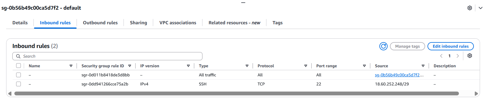
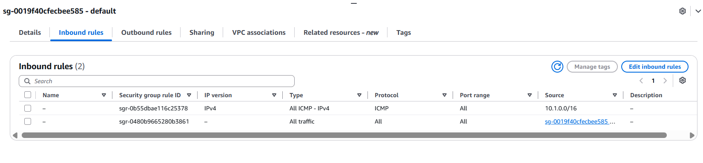

---

# 8. Testing Cross-VPC Connectivity

After configuring the peering connection, route tables, and Security Groups, I tested communication between the EC2 instances.
I used the `ping` command to test whether one EC2 instance could reach the private IP address of the instance in the other VPC.

The command used was:

```bash
ping <PEER_VPC_EC2_PRIVATE_IP>
```

For example:

```bash
ping 10.2.1.x
```

The destination was the private IP address of the EC2 instance located in the peer VPC.

---

# 9. Initial Connectivity Test

The initial connectivity test was used to determine whether the two VPCs could communicate successfully.
If the connection failed, the configuration was reviewed layer by layer.

The troubleshooting process included checking:

* VPC CIDR ranges
* VPC peering connection status
* Route tables
* Destination CIDRs
* Peering connection target
* Security Group rules
* Subnet configuration

This reinforced the importance of checking every networking layer rather than assuming that an active peering connection automatically provides connectivity.


---

# 10. Successful Cross-VPC Connectivity

After configuring the required routes and security permissions, I repeated the connectivity test.
The `ping` command successfully returned responses from the EC2 instance in the peer VPC.

```text
PING <PEER_VPC_EC2_PRIVATE_IP>

64 bytes from <PEER_VPC_EC2_PRIVATE_IP>: icmp_seq=1 ttl=64 time=...
64 bytes from <PEER_VPC_EC2_PRIVATE_IP>: icmp_seq=2 ttl=64 time=...
```

This confirmed that traffic could successfully travel between the two VPCs using the VPC peering connection.

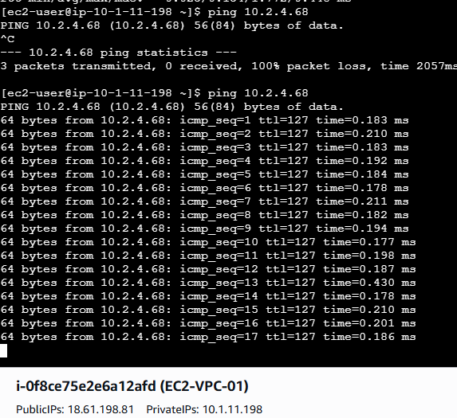

---

# VPC Peering Traffic Flow

The resulting traffic flow can be represented as:

```text
EC2 Instance
VPC 1
10.1.1.x
    │
    ▼
Subnet Route Table
    │
    │ Destination: 10.2.0.0/16
    ▼
VPC Peering Connection
    │
    ▼
VPC 2 Route Table
    │
    ▼
EC2 Instance
VPC 2
10.2.1.x
```

For return traffic, the reverse route is required:

```text
VPC 2
10.2.0.0/16
    │
    ▼
Route Table
    │
    │ Destination: 10.1.0.0/16
    ▼
VPC Peering Connection
    │
    ▼
VPC 1
10.1.0.0/16
```

---

# VPC Peering vs Internet Connectivity

VPC peering allows resources in different VPCs to communicate using private IP addresses.
The traffic does not need to travel through the public internet.

```text
VPC 1
  │
  │ Private IP Traffic
  ▼
VPC Peering Connection
  │
  │ Private IP Traffic
  ▼
VPC 2
```

This makes VPC peering useful when applications deployed in separate VPCs need private communication.

---

# Connectivity Troubleshooting Workflow

The project provided practical experience with a structured approach to troubleshooting VPC peering connectivity.
The general workflow followed was:

```text
Connectivity Failure
        │
        ▼
Check VPC CIDR Ranges
        │
        ▼
Check Peering Status
        │
        ▼
Check Route Table
        │
        ▼
Check Destination CIDR
        │
        ▼
Check Peering Target
        │
        ▼
Check Security Group
        │
        ▼
Retest Connectivity
        │
        ▼
Successful Connection
```

This approach helps identify whether the problem is caused by network addressing, routing, or security configuration.

---

# Network Components Involved

The project demonstrated how several AWS networking components work together.

### VPC

Provides an isolated virtual network in AWS.

### Subnet

Provides a smaller network segment within a VPC where resources can be deployed.

### Route Table

Determines where network traffic should be sent.

### VPC Peering Connection

Provides a private networking path between two VPCs.

### Security Group

Controls inbound and outbound traffic at the EC2 resource level.

### EC2

Provides the compute resources used to test communication between the VPCs.

---

# Challenges & Troubleshooting

## Challenge 1 — VPCs Could Not Be Peered

### Problem

The VPC peering connection could not be established correctly.

### Investigation

I reviewed the CIDR ranges assigned to both VPCs.

### Resolution

I ensured that the VPCs used non-overlapping CIDR blocks.

```text
VPC 1 → 10.1.0.0/16
VPC 2 → 10.2.0.0/16
```

### Learning

IP address planning is important when designing networks that need to communicate with one another.

---

## Challenge 2 — Peering Connection Was Active but Connectivity Failed

### Problem

The VPC peering connection was active, but the EC2 instances could not communicate.

### Investigation

I reviewed the route tables associated with the subnets.

### Cause

The route tables did not contain the required routes pointing traffic destined for the peer VPC CIDR toward the VPC peering connection.

### Resolution

I added the appropriate routes to both VPCs.

```text
VPC 1 Route Table
10.2.0.0/16 → VPC Peering Connection

VPC 2 Route Table
10.1.0.0/16 → VPC Peering Connection
```

---

## Challenge 3 — Security Group Blocking Traffic

### Problem

The routing configuration was correct, but the connectivity test still failed.

### Investigation

I reviewed the Security Group associated with the EC2 instances.

### Resolution

I configured the Security Group to allow the required traffic from the peer VPC.

The connectivity test then succeeded.

---

# Key Concepts Learned

## VPC Peering

VPC peering provides private connectivity between two VPCs.

It allows resources in separate VPCs to communicate using private IP addresses.

---

## VPC Peering Does Not Automatically Configure Routes

One of the most important concepts learned from this project was that creating a peering connection does not automatically add routes.
The route tables must explicitly contain routes for the peer VPC's CIDR range.

```text
VPC Peering
      +
Route Table Configuration
      +
Security Permissions
      =
Cross-VPC Connectivity
```

---

## CIDR Planning

VPCs that need to communicate through peering should use non-overlapping IP address ranges.

For example:

```text
10.1.0.0/16
        +
10.2.0.0/16
```

These ranges do not overlap and can therefore be used for separate networks that need to communicate.

---

## Routing Is Bidirectional

For two-way communication, both VPCs need appropriate routes.

```text
VPC 1 → VPC 2
10.2.0.0/16 → Peering Connection

VPC 2 → VPC 1
10.1.0.0/16 → Peering Connection
```

A route in only one VPC is not enough for normal two-way communication.

---

## Security Still Applies Across Peering

VPC peering does not bypass Security Groups.
The resources on both sides must still have appropriate security rules allowing the required traffic.

---

# What I Learned

This project significantly improved my understanding of how separate Amazon VPC networks can communicate using VPC peering.

I learned how to create two independent VPCs, configure non-overlapping CIDR ranges, establish a VPC peering connection, and configure route tables to direct traffic between the networks.

The most valuable part of the project was understanding that an active peering connection alone does not guarantee connectivity. The route tables and Security Groups must also be configured correctly.

Testing the connection using private IP addresses helped reinforce how AWS can provide private communication between resources in separate VPCs without requiring traffic to travel through the public internet.

This project also strengthened my ability to troubleshoot AWS networking issues by analyzing the configuration layer by layer.

---

# Key Takeaways

* VPC peering connects two VPCs using a private networking path.
* VPCs should use non-overlapping CIDR ranges when they need to communicate.
* Creating a peering connection does not automatically configure route tables.
* Both VPCs require appropriate routes for bidirectional communication.
* Route tables determine where traffic destined for the peer VPC is sent.
* Security Groups can still allow or block traffic across a peering connection.
* VPC peering uses private IP addresses for communication between VPCs.
* `ping` can be used to test connectivity between resources when ICMP is permitted.
* Troubleshooting should include checking CIDRs, peering status, routes, and security rules.
* Understanding routing is essential when designing interconnected AWS networks.

---

# Screenshots

Implementation evidence for this project is available in the [`screenshots`](screenshots/) directory.

---

# Project Status

**Completed**