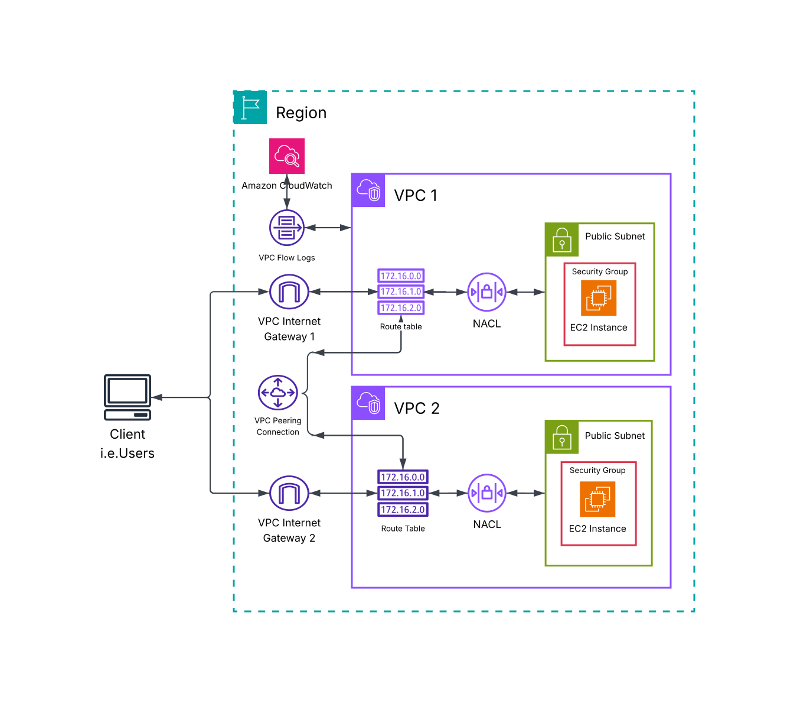
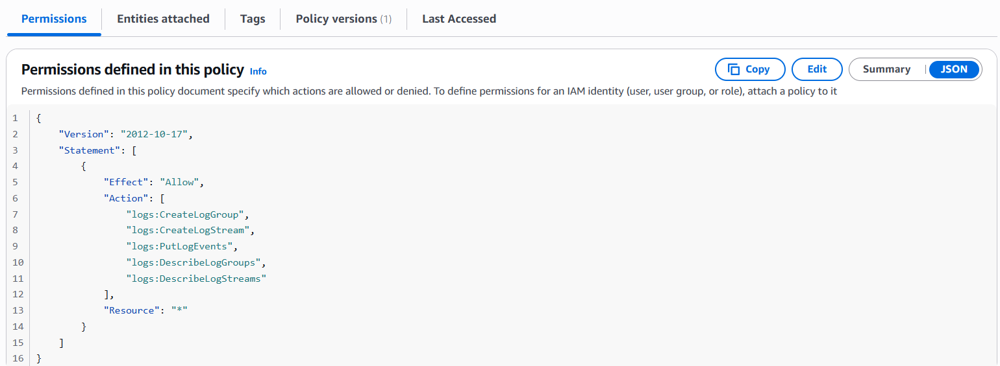
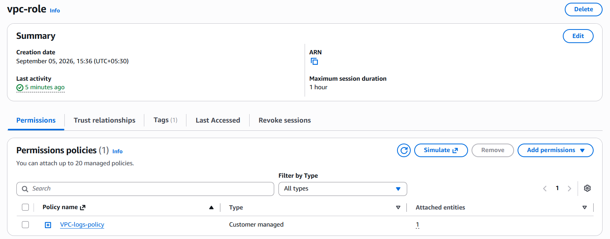
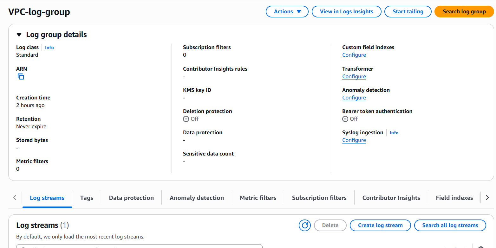
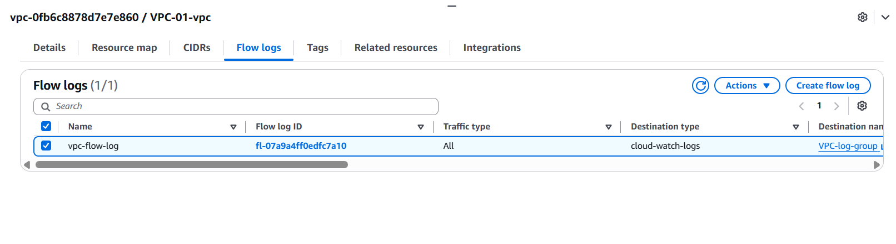
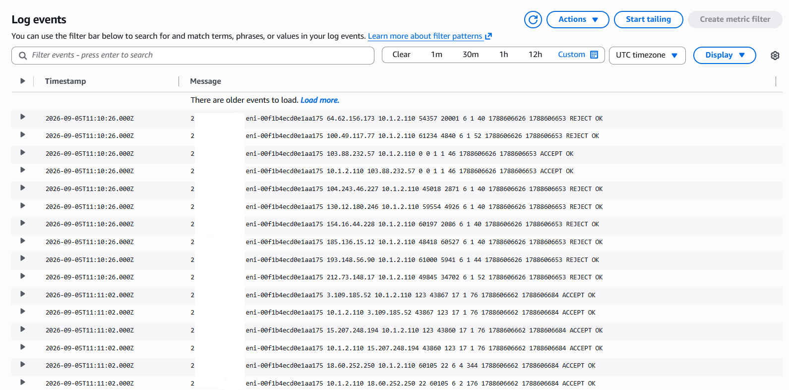
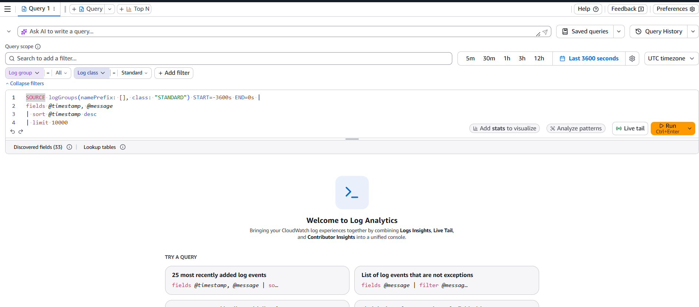
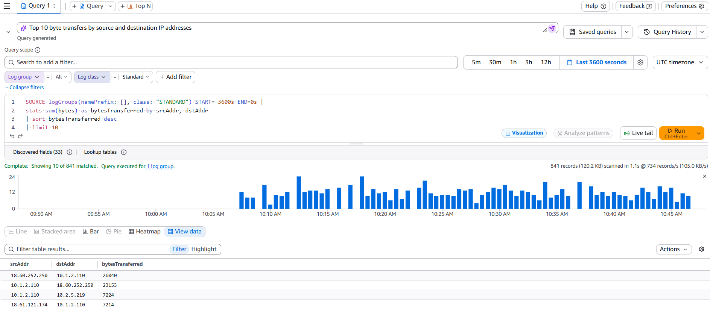

# Project 7 — VPC Monitoring with Flow Logs

## Overview

This project focused on implementing network monitoring for an Amazon VPC using **VPC Flow Logs** and **Amazon CloudWatch**.

The project involved creating the required IAM permissions and role for VPC Flow Logs, creating a CloudWatch Logs log group, configuring a VPC Flow Log to capture network traffic, and analyzing the collected traffic using **CloudWatch Logs Insights**.

A key part of the project was using Logs Insights to query VPC Flow Logs and identify the **top 10 source and destination IP address pairs by amount of data transferred**. This provided practical experience in monitoring network traffic, identifying high-volume connections, and using logs for network troubleshooting and analysis.

---

# Objectives

* Understand the purpose of VPC Flow Logs
* Understand how VPC Flow Logs support network monitoring and troubleshooting
* Create an IAM policy for VPC Flow Logs
* Create an IAM role that allows the VPC Flow Logs service to write to CloudWatch
* Create a CloudWatch Logs log group
* Configure VPC Flow Logs
* Configure the maximum aggregation interval
* Send VPC Flow Logs to CloudWatch Logs
* Access and inspect VPC Flow Log streams
* Use CloudWatch Logs Insights to analyze network traffic
* Run a query to identify the top 10 byte transfers by source and destination IP addresses
* Understand important fields contained in VPC Flow Log records
* Understand Elastic Network Interfaces (ENIs)
* Use network logs for monitoring and troubleshooting

---

# AWS Services & Technologies

* **Amazon VPC**
* **VPC Flow Logs**
* **Amazon CloudWatch**
* **CloudWatch Logs**
* **CloudWatch Logs Insights**
* **AWS IAM**
* **IAM Policies**
* **IAM Roles**
* **Elastic Network Interfaces (ENIs)**
* **AWS Management Console**

---

# Architecture



---

# 1. Understanding VPC Flow Logs

A **VPC Flow Log** records information about IP traffic going to and from network interfaces within a VPC.

Flow Logs can provide useful information such as:

* Source IP address
* Destination IP address
* Source port
* Destination port
* Protocol
* Number of packets
* Number of bytes
* Traffic action
* Network interface information

These records can be used for:

* Network troubleshooting
* Security investigations
* Traffic analysis
* Identifying unexpected traffic
* Understanding network behavior

VPC Flow Logs therefore provide visibility into network traffic that would otherwise be difficult to inspect directly.

---

# 2. Creating an IAM Policy

Before configuring VPC Flow Logs to publish data to CloudWatch Logs, I created an IAM policy containing the permissions required to create log groups, create log streams, and publish log events.

The policy included permissions such as:

```text
logs:CreateLogGroup
logs:CreateLogStream
logs:PutLogEvents
logs:DescribeLogGroups
logs:DescribeLogStreams
```

These permissions allow the VPC Flow Logs service to interact with CloudWatch Logs.



---

# 3. Creating the IAM Role

After creating the policy, I created an IAM role that could be assumed by the VPC Flow Logs service.

The role's trust relationship specifies the VPC Flow Logs service as the trusted principal.

```text
Service:
vpc-flow-logs.amazonaws.com
```

The required CloudWatch Logs policy was then attached to the role.



### Why the Role Is Required

The IAM role provides VPC Flow Logs with the permissions required to publish log data to CloudWatch Logs.

The architecture can therefore be represented as:

```text
VPC Flow Logs
      │
      │ Assume IAM Role
      ▼
IAM Role
      │
      │ Permissions
      ▼
CloudWatch Logs
```

---

# 4. Creating the CloudWatch Log Group

I created a dedicated log group in **Amazon CloudWatch Logs** to store the VPC Flow Log records.

The log group was created in the same AWS Region as the VPC resources being monitored.

```text
Log Group:
VPC Flow Logs
```

CloudWatch resources are Region-specific, so the appropriate AWS Region must be selected when configuring and analyzing the logs.



---

# 5. Configuring VPC Flow Logs

After creating the IAM role and CloudWatch log group, I configured VPC Flow Logs for the VPC.

The configuration included:

* Selecting the VPC
* Creating the flow log
* Selecting CloudWatch Logs as the destination
* Selecting the appropriate IAM role
* Selecting the CloudWatch log group
* Configuring the maximum aggregation interval

The maximum aggregation interval was configured to:

```text
1 minute
```

This determines the maximum amount of time over which traffic information can be aggregated into a flow log record.



---

# 6. Flow Log Records

Once the VPC Flow Log was active and traffic was generated, log data became available in the configured CloudWatch log group.

The log group contains **log streams**, which contain the individual flow log records.

```text
CloudWatch Log Group
        │
        ├── Log Stream
        │     ├── Flow Log Record
        │     ├── Flow Log Record
        │     └── Flow Log Record
        │
        └── Log Stream
              ├── Flow Log Record
              └── Flow Log Record
```



---

# 7. Analyzing Logs with CloudWatch Logs Insights

After the flow logs were available, I used **CloudWatch Logs Insights** to analyze the collected traffic.

Logs Insights provides a query interface for searching, filtering, and analyzing CloudWatch log data.

I selected the VPC Flow Logs log group as the source for the analysis.



---

# 8. Top 10 Byte Transfers

One of the queries used during the project identified the **top 10 source and destination IP address pairs based on the amount of data transferred**.

The query was applied from the VPC Flow Logs saved/sample queries.

```text
VPC Flow Logs
    ↓
Top 10 byte transfers by source and destination IP addresses
    ↓
Apply
    ↓
Run query
```



The results identify the IP address pairs that transferred the largest amount of data within the monitored network.

This can be useful for identifying:

* High-volume network connections
* Unexpected traffic patterns
* Heavy data transfers
* Potential areas requiring further investigation

---

# 9. Understanding the Query Results

The query results contain information about source and destination IP addresses and the amount of traffic transferred between them.

By ranking traffic according to bytes transferred, it becomes possible to identify the network connections generating the greatest volume of traffic.

For example:

```text
Source IP       Destination IP       Bytes
------------------------------------------------
10.x.x.x        10.x.x.x             High
10.x.x.x        10.x.x.x             High
10.x.x.x        10.x.x.x             ...
```

The exact values depend on the traffic generated within the monitored VPC.

---

# 10. Understanding ENI

While analyzing the VPC Flow Logs, I encountered the field related to the **Elastic Network Interface (ENI)**.

An ENI is a virtual network interface that provides network connectivity for resources within a VPC.

For example:

```text
EC2 Instance
     │
     ▼
Elastic Network Interface
     │
     ▼
VPC Network
```

Flow Logs associate network traffic with the relevant network interface, making ENI information useful when identifying which resource is associated with a particular traffic flow.

---

# 11. Why VPC Monitoring Matters

Network monitoring provides visibility into how traffic moves through a cloud environment.

Without network logs, troubleshooting can become difficult because it may not be immediately obvious:

* Which IP addresses are communicating
* How much data is being transferred
* Whether traffic is being accepted or rejected
* Which network interfaces are involved
* Whether unexpected traffic is occurring

VPC Flow Logs provide a valuable source of network-level information for investigation and troubleshooting.

---

# Traffic Monitoring Workflow

The complete workflow implemented in this project was:

```text
Create IAM Policy
        │
        ▼
Create IAM Role
        │
        ▼
Create CloudWatch Log Group
        │
        ▼
Configure VPC Flow Logs
        │
        ▼
Generate / Capture Network Traffic
        │
        ▼
CloudWatch Log Streams
        │
        ▼
CloudWatch Logs Insights
        │
        ▼
Query Flow Log Data
        │
        ▼
Analyze Network Traffic
```

---

# Monitoring and Troubleshooting Use Cases

The monitoring architecture developed in this project can support several operational use cases.

### Network Troubleshooting

Flow Logs can help determine whether traffic is flowing between network resources and provide information about the traffic involved.

### Traffic Analysis

Traffic can be analyzed based on source, destination, protocol, ports, packets, and bytes.

### Security Investigation

Unexpected communication patterns or unusually large data transfers can be investigated using flow log records.

### Network Visibility

Flow Logs provide a historical record of network traffic that can be analyzed using CloudWatch Logs Insights.

---

# Challenges & Troubleshooting

## Challenge 1 — Providing Permissions to VPC Flow Logs

### Problem

VPC Flow Logs require permission to publish their records to CloudWatch Logs.

### Resolution

I created an IAM policy with the required CloudWatch Logs permissions and attached it to an IAM role trusted by the VPC Flow Logs service.

---

## Challenge 2 — Finding and Analyzing Flow Logs

### Problem

After configuring flow logs, the raw log records contain a large amount of network information.

### Resolution

I used CloudWatch Logs Insights to query the log group and analyze the data instead of manually inspecting every record.

The saved VPC Flow Logs query for the top 10 byte transfers provided a useful way to identify high-volume source and destination pairs.

---

# Security Considerations

The project also reinforced the importance of controlling permissions when integrating AWS services.

The IAM role used by VPC Flow Logs should have the permissions required for its intended purpose rather than unnecessary administrative permissions.

The monitoring architecture follows the principle:

```text
VPC Flow Logs
      ↓
IAM Role
      ↓
Only required CloudWatch Logs permissions
      ↓
CloudWatch Logs
```

No AWS access keys, secret keys, passwords, private keys, or other credentials are stored in this repository.

---

# Key Concepts Learned

## VPC Flow Logs

VPC Flow Logs provide visibility into IP traffic associated with network interfaces in a VPC.

## IAM Role

An IAM role provides temporary permissions to AWS services or other trusted entities.

In this project, the role allowed the VPC Flow Logs service to publish logs to CloudWatch.

## CloudWatch Logs

CloudWatch Logs provides centralized storage for log data generated by AWS services and resources.

## CloudWatch Logs Insights

Logs Insights provides a query-based interface for searching and analyzing CloudWatch log data.

## Log Groups

A log group is a logical container for related log streams.

## Log Streams

A log stream contains a sequence of log events from a particular source.

## Elastic Network Interface

An ENI is a virtual network interface associated with resources within a VPC and provides network connectivity.

---

# What I Learned

This project introduced me to practical network monitoring within AWS.

I learned how VPC Flow Logs can capture network traffic information and how IAM permissions are required for the flow logs service to publish data to CloudWatch Logs.

I also learned how CloudWatch Logs Insights can transform large amounts of raw log data into useful network information through queries.

The most useful part of the project was analyzing the **top 10 byte transfers by source and destination IP addresses**. This demonstrated how network logs can be used to identify high-volume traffic and support troubleshooting or security investigations.

---

# Key Takeaways

* VPC Flow Logs provide visibility into network traffic.
* IAM permissions are required for VPC Flow Logs to publish logs to CloudWatch.
* IAM roles allow AWS services to access other AWS services securely.
* CloudWatch Logs provides centralized storage for flow log data.
* Logs Insights can query and analyze large amounts of log data.
* Flow logs contain useful information about IP traffic and network interfaces.
* ENIs provide network connectivity for VPC resources.
* Traffic can be analyzed based on source, destination, bytes, packets, and other fields.
* The top 10 byte transfer query can help identify high-volume network flows.
* Network monitoring is an important part of troubleshooting and security operations.

---

# Screenshots

Implementation evidence for this project is available in the [`screenshots`](screenshots/) directory.

---

# Project Status

**Completed**